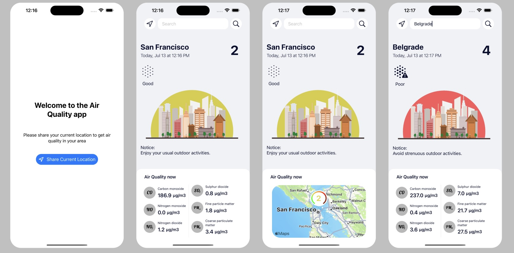

# Air Quality Index (AQI) App

This iOS app built in Swift fetches data from the OpenWeather API to provide the current Air Quality Index (AQI) for a specified location or the user's current location. It also includes an interactive map with visualizations of the air quality data.

## Features

- Fetches data from the OpenWeather API to obtain the current Air Quality Index (AQI).
- Displays the AQI for the user's current location or a searched location.
- Visualizes air quality data on an interactive map.
- Provides information about different air pollutants.

## Screenshots

## Getting Started

To run the app locally and explore its functionality, follow these steps:

1. Clone the repository:

git clone https://github.com/bojicuros/AirQuality.git

2. Open the project in Xcode:
- Open Xcode and go to "File" > "Open".
- Navigate to the cloned repository and select the Xcode project file (with the .xcodeproj extension).

3. Configure API keys:
- Obtain an API key from OpenWeather (https://openweathermap.org/).
- In Xcode, navigate to the "Constants.swift" file in the project navigator.
- Replace `"YOUR_API_KEY"` with your actual OpenWeather API key.

4. Build and run the app:
- Select a simulator or a connected device in Xcode.
- Press the play button or use the shortcut `Cmd + R` to build and run the app.

## Contributing

Contributions to this project are welcome. If you encounter any issues or have suggestions for improvements, please submit a pull request or open an issue in the GitHub repository.

